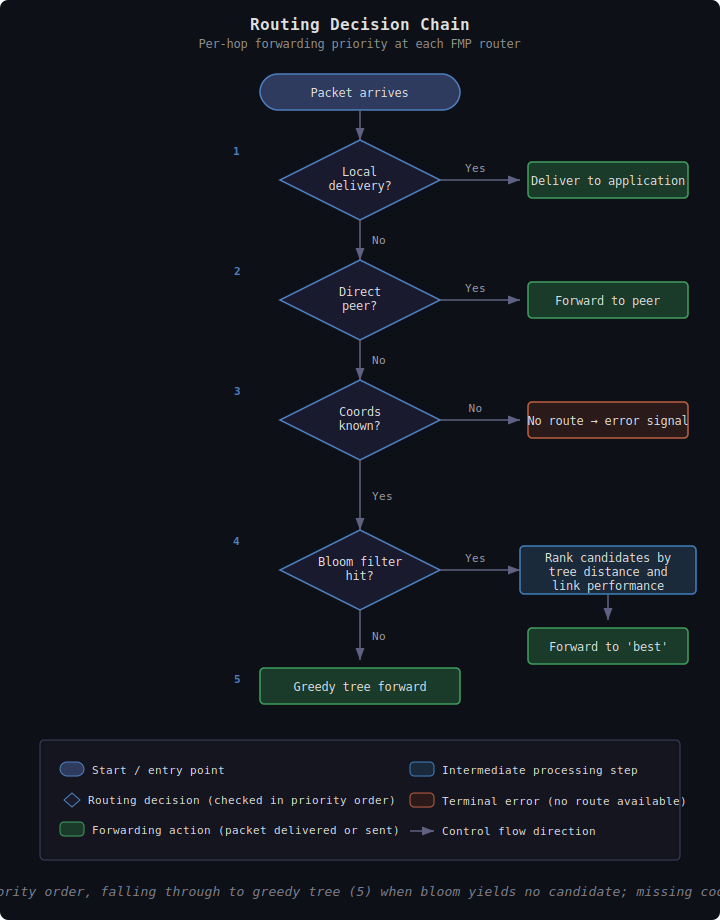
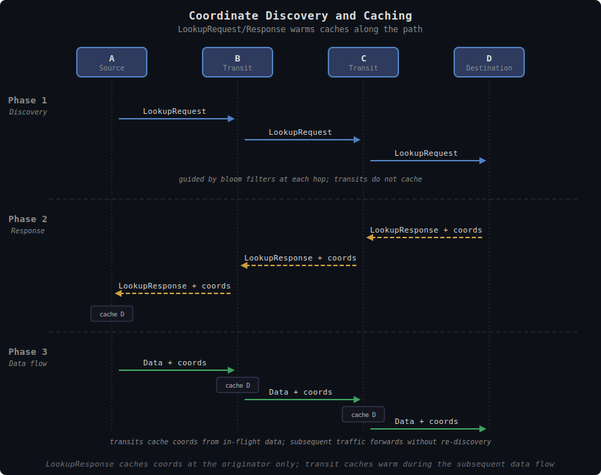

# FIPS Mesh Operation

This document describes how the FIPS mesh operates at the link layer — how
spanning tree, bloom filters, routing decisions, discovery, and error recovery
work together as a coherent system. It treats spanning tree and bloom filters
as black boxes (what they provide to routing) and focuses on how the pieces
interact.

For spanning tree algorithms and data structures, see
[fips-spanning-tree.md](fips-spanning-tree.md). For bloom filter parameters
and mathematics, see [fips-bloom-filters.md](fips-bloom-filters.md).

## Overview

FIPS mesh operation is entirely distributed. Each node makes forwarding
decisions using only local information: its direct peers, their spanning tree
positions, and their bloom filters. There are no routing tables pushed from
above, no link-state floods, and no distance-vector exchanges.

Two complementary mechanisms provide the information each node needs:

- **Spanning tree** gives every node a coordinate in the network — its
  ancestry path from itself to the root. These coordinates enable distance
  calculations between any two nodes without global topology knowledge.
- **Bloom filters** summarize which destinations are reachable through each
  peer. Because they propagate along tree edges, they encode directional
  reachability — which subtree contains a given destination.

Together, they enable a routing decision process that is local, efficient,
and self-healing.

## Spanning Tree Formation and Maintenance

For routing purposes, the spanning tree provides each node with a
coordinate (its ancestry path from itself to the root) plus a way to
compute distance between any two nodes (hops to their lowest common
ancestor). The strictly-decreasing distance invariant gives greedy
forwarding its loop-freedom.

The tree forms through distributed parent selection — root is the
smallest node_addr (no election), and each node picks the peer with
the lowest `effective_depth = depth + link_cost`. Cost-aware parent
selection lets the tree trade hop count for link quality once MMP has
accumulated SRTT and ETX metrics. Hysteresis (20% improvement
required to switch) and hold-down (suppress non-mandatory
re-evaluation after a switch) keep the tree stable under metric
noise. Partitions self-resolve — each segment converges to its own
root and reconverges to the smallest reachable root when segments
rejoin.

Liveness is detected via FMP heartbeats; dead-peer removal triggers
tree reconvergence and bloom filter recomputation for the affected
subtree. The heartbeat and dead-timeout mechanism lives at the link
layer; see [fips-mesh-layer.md](fips-mesh-layer.md#liveness-detection).

For the parent-selection algorithm, hold-down/hysteresis details, and
the convergence walkthroughs, see
[fips-spanning-tree.md](fips-spanning-tree.md) and
[spanning-tree-dynamics.md](spanning-tree-dynamics.md).

## Bloom Filter Gossip and Propagation

For routing purposes, each node maintains a bloom filter per peer
that answers "can peer P possibly reach destination D?" — either "no"
(definitive) or "maybe" (probabilistic). Because filters propagate
along tree edges with split-horizon exclusion, a bloom hit on a tree
peer reliably indicates which subtree contains the destination, and
tree-coordinate distance ranks competing matches.

FilterAnnounce updates are event-driven (peer changes, tree
restructuring, local identity changes) and rate-limited to prevent
storms. False positives at large scale never cause loops — the
self-distance check at each hop guarantees forward progress, and
mismatched bloom matches fall through to greedy tree routing.

For the filter computation, split-horizon merge rules, FPR analysis,
size classes, and folding, see
[fips-bloom-filters.md](fips-bloom-filters.md).

## Routing Decision Process

At each hop, FMP makes a local forwarding decision using the `find_next_hop()`
priority chain. This is the core routing algorithm.

### Priority Chain

1. **Local delivery** — The destination node_addr matches the local node.
   Deliver to FSP above.

2. **Direct peer** — The destination is an authenticated neighbor. Forward
   directly. No coordinates or bloom filters needed.

3. **Coordinate cache check** — Multi-hop forwarding requires the
   destination's tree coordinates to be in the local cache. On miss,
   `find_next_hop()` returns None immediately — bloom filters are never
   consulted — and the source receives a CoordsRequired error signal.

4. **Bloom-guided routing** — One or more peers' bloom filters contain the
   destination. Select the best peer by composite key:
   `(link_cost, tree_distance, node_addr)`.

5. **Greedy tree routing** — Fall-through when bloom yields no candidate.
   Forward to the peer that minimizes tree distance. If the tree has no
   next hop closer to the destination, the source receives a PathBroken
   error signal.

### Convergence Requirements

Multi-hop routing depends on two propagation processes that must run
to convergence simultaneously:

1. **Bloom convergence**: Filters must propagate so peers advertise
   reachability
2. **Coordinate availability**: Destination coordinates must be cached at
   every transit node on the path

Bloom convergence without coordinates trips step 3 (coord-cache miss →
CoordsRequired). Coordinates without bloom convergence falls through to
greedy tree routing — functional but suboptimal.

### Candidate Ranking

When bloom filters identify multiple candidate peers, they are ranked by a
composite key:

1. **link_cost** — Per-link quality metric derived from ETX (Expected
   Transmission Count), computed from bidirectional delivery ratios in MMP
   metrics. In practice this is an uncommon tie-breaker: most forwarding
   decisions are resolved by tree distance alone, and link_cost only
   differentiates candidates when multiple peers offer the same tree distance
   to the destination.
2. **tree_distance** — Coordinate-based distance to destination through this
   peer
3. **node_addr** — Deterministic tie-breaker

A peer with a bloom filter hit but no entry in the peer ancestry table
(missing TreeAnnounce) defaults to maximum distance and is effectively
invisible to routing.

### Routing Decision Flowchart

### Loop Prevention

The routing decision enforces strict progress: a packet is only forwarded
to a peer that is strictly closer (by tree distance) to the destination than
the current node. This self-distance check prevents routing loops even with
stale coordinates, because each transit node evaluates using its own
freshly-computed coordinates.

If no peer is closer than the current node (a local minimum in the tree
distance metric), `find_next_hop()` returns None and the caller generates a
PathBroken error.

## Coordinate Caching

The coordinate cache maps `NodeAddr → TreeCoordinate` and is the
critical data structure for multi-hop routing. The session layer owns
this cache (its eviction policy, TTL/refresh semantics, parent-change
flush, and timer ordering with session idle timeout); see
[fips-session-layer.md](fips-session-layer.md#coordinate-cache) for
the canonical treatment.

## Discovery Protocol

Discovery resolves a destination's tree coordinates so that multi-hop routing
can proceed. Requests are forwarded using **bloom-guided tree routing** —
only to tree peers (parent + children) whose bloom filter contains the
target — producing single-path forwarding through the spanning tree.

### When Discovery Is Needed

- First contact with a destination (no cached coordinates)
- After receiving CoordsRequired (transit node lost coordinates)
- After receiving PathBroken (coordinates may be stale)

### LookupRequest

The source creates a LookupRequest containing:

- **request_id**: Unique identifier for deduplication
- **target**: The node_addr being sought
- **origin**: The requester's node_addr
- **origin_coords**: The requester's current tree coordinates (so the
  response can route back)
- **TTL**: Bounds the forwarding radius

### Bloom-Guided Tree Routing

Rather than flooding to all peers, the request is forwarded only to **tree
peers** (parent + children) whose bloom filter contains the target. Because
bloom filters propagate along tree edges with split-horizon exclusion,
typically only one tree peer matches — producing a single directed path
through the spanning tree toward the target's subtree. This reduces
discovery traffic by roughly 90% compared to flooding.

If no tree peer's bloom filter matches the target, the request falls back
to **non-tree peers** whose bloom filter contains the target. This recovers
from dead ends caused by stale bloom filters, tree restructuring, or transit
node failures. If no peer at all has a bloom match, the request is dropped
at that node.

**Loop prevention**: The spanning tree is inherently loop-free, so tree-only
forwarding cannot loop. The `request_id` dedup cache (default 10s window)
provides defense-in-depth, catching edge cases during tree restructuring
where a request might arrive via both tree and fallback paths.

### Retry Logic

Single-path forwarding is more fragile than flooding — if any transit node
on the path has a stale bloom filter or loses a link, the request fails.
To compensate, each discovery is a sequence of attempts with growing
per-attempt timeouts. The default sequence is `[1s, 2s, 4s, 8s]`
(configurable via `node.discovery.attempt_timeouts_secs`); the destination
is declared unreachable only after the full sequence is exhausted (15s
total at default).

When the current attempt's deadline elapses without a `LookupResponse`,
the originator sends another `LookupRequest` with a **fresh `request_id`**
and the next entry in the sequence as its deadline. Fresh `request_id`s
let each attempt take a different forwarding path as the bloom and tree
state evolve, which is particularly useful during cold-start convergence.

### Originator Backoff (optional, off by default)

After the per-attempt sequence is exhausted, the originator can additionally
suppress further fresh lookups for the same target with exponential
post-failure backoff. This is **disabled by default** (`backoff_base_secs:
0`); the per-attempt sequence is the only retry pacing in the standard
configuration. Operators may opt in via `node.discovery.backoff_base_secs`
and `node.discovery.backoff_max_secs` if their deployment has chatty apps
generating repeated lookups for genuinely unreachable destinations. When
enabled, backoff is **reset on topology changes** that might make
previously unreachable targets reachable: parent switch, new peer
connection, first RTT measurement from MMP, or peer reconnection.

### Bloom Filter Pre-Check

Before initiating a lookup, the originator checks whether *any* peer's
bloom filter contains the target. If no peer advertises reachability, the
lookup is skipped entirely and recorded as a failure for backoff purposes.
This avoids wasting network resources when the target is not in the mesh.

### Transit-Side Rate Limiting

Transit nodes enforce a per-target minimum interval (default 2s, configurable
via `forward_min_interval_secs`) for forwarded lookups. This is
defense-in-depth against misbehaving nodes that generate fresh `request_id`s
at high rate to bypass dedup. The rate limiter collapses rapid-fire lookups
for the same target regardless of `request_id`.

### LookupResponse

When the request reaches the target (or a node that has the target as a
direct peer), a LookupResponse is created containing:

- **request_id**: Echoed from the request
- **target**: The target's node_addr
- **target_coords**: The target's current tree coordinates
- **path_mtu**: Minimum MTU along the response path (transit-annotated,
  initialized to `u16::MAX` by the target)
- **proof**: Signature covering `(request_id || target || target_coords)` —
  authenticates that the response is genuine and the target holds the
  claimed tree position

The response routes back to the requester using **reverse-path routing** as
the primary mechanism: each transit node looks up the `request_id` in its
`recent_requests` table to find the peer that forwarded the original request,
and sends the response back through that peer. This ensures the response
follows the same path as the request. Greedy tree routing toward the
`origin_coords` is used only as a fallback if the reverse-path entry has
expired.

**Response-forwarded flag**: Each `recent_requests` entry tracks whether a
response has already been forwarded for that `request_id`. If a second
response arrives (e.g., from convergent request paths that reached the
target via different routes), the transit node drops it. This prevents
response routing loops where multiple responses for the same request
circulate through the network.

**Proof verification**: The source verifies the Schnorr proof upon receipt,
confirming that the target actually signed the response. The proof covers
`(request_id || target || target_coords)` — coordinates are included because
verification at the source confirms the target holds the claimed position.
The `path_mtu` field is excluded from the proof because it is a transit
annotation modified at each hop.

### Coordinate Discovery Sequence

### Discovery Outcome

On receiving a verified LookupResponse, the source caches the target's
coordinates and clears any backoff state for that target. Subsequent routing
to that destination can proceed via the normal `find_next_hop()` priority
chain.

If discovery times out (no response after all retry attempts), queued
packets receive ICMPv6 Destination Unreachable and the target enters
backoff.

## Coordinate Cache Warming

SessionSetup carries plaintext source and destination coordinates,
which transit nodes cache as the message travels — warming the
forward path. SessionAck carries them back along the reverse path,
warming return-path caches. Steady-state data packets piggyback
coordinates via the FSP CP flag during the warmup window, falling
back to standalone CoordsWarmup messages when piggybacking would
exceed the transport MTU. See
[fips-session-layer.md](fips-session-layer.md#hybrid-coordinate-warmup-strategy)
for the canonical hybrid-warmup design (SessionSetup
self-bootstrapping plus CP-flag piggyback plus standalone
CoordsWarmup).

## Error Recovery

When routing fails, transit nodes signal the source endpoint so it can take
corrective action.

### CoordsRequired

**Trigger**: A transit node receives a SessionDatagram but has no cached
coordinates for the destination. It cannot make a forwarding decision.

**Transit node action**:

1. Create a new SessionDatagram addressed back to the original source,
   carrying a CoordsRequired payload identifying the unreachable destination
2. Route the error via `find_next_hop(src_addr)`
3. If the source is also unreachable, drop silently (no cascading errors)

**Source recovery**:

1. Immediately send a standalone CoordsWarmup (0x14) message to re-warm
   transit caches along the path (rate-limited: at most one per destination
   per configurable interval, default 2s)
2. Reset CP warmup counter — subsequent data packets piggyback coordinates
   when possible, or trigger additional CoordsWarmup messages when
   piggybacking would exceed the transport MTU
3. Initiate discovery (bloom-guided LookupRequest) for the destination
4. When discovery completes, warmup counter resets again (covers timing gap)

The crypto session remains active throughout — only routing state is
refreshed.

### PathBroken

**Trigger**: A transit node has cached coordinates for the destination but
no peer is closer to the destination than itself (a local minimum in the
tree distance metric). The cached coordinates may be stale.

**Transit node action**: Same as CoordsRequired — generate error back to
source.

**Source recovery**:

1. Immediately send a standalone CoordsWarmup (0x14) message (rate-limited,
   same per-destination interval as CoordsRequired response)
2. Remove stale coordinates from cache
3. Initiate discovery for the destination
4. Reset CP warmup counter

### MtuExceeded

**Trigger**: A transit node receives a SessionDatagram but the total
packet size exceeds the next-hop link MTU. The packet cannot be forwarded
without fragmentation, which FIPS does not perform at the mesh layer.

**Transit node action**:

1. Create a new SessionDatagram addressed back to the original source,
   carrying an MtuExceeded payload identifying the destination, the
   reporting router, and the bottleneck MTU
2. Route the error via `find_next_hop(src_addr)`
3. Drop the original oversized packet

**Source recovery**: FSP uses the reported bottleneck MTU to adjust its
session-layer path MTU estimate (immediate decrease). The source can then
reduce payload sizes to fit within the discovered path MTU. MtuExceeded is
the reactive complement to the proactive `path_mtu` field in
SessionDatagram and LookupResponse — the proactive field tracks the
minimum MTU along the forward path, while MtuExceeded signals when an
actual packet exceeds the limit.

### Error Signal Rate Limiting

All three error types are rate-limited at transit nodes: maximum one error per
destination per 100ms. This prevents storms during topology changes when many
packets to the same destination hit the same routing failure simultaneously.

At the source side, CoordsWarmup responses to CoordsRequired/PathBroken are
independently rate-limited: at most one standalone CoordsWarmup per destination
per `coords_response_interval_ms` (default 2000ms, configurable). This
prevents amplification where a burst of error signals would generate a
corresponding burst of warmup messages.

Error signals (CoordsRequired, PathBroken, MtuExceeded) are handled
asynchronously outside the packet receive path, allowing the RX loop to
continue processing without blocking on discovery or session repair.

### Error Routing Limitation

Error signals route back to the source using `find_next_hop(src_addr)`. For
steady-state data packets (after the CP warmup window), the
transit node may lack cached coordinates for the source. If so, the error is
silently dropped.

This blind spot is partially addressed by CP warmup: transit
nodes receive source coordinates during the warmup phase. But after warmup
expires and transit caches for the source expire, errors may be lost. The
session idle timeout (90s) limits the window — if traffic stops long enough
for transit caches to fully expire, the session tears down and re-establishment
re-warms the path.

## Cold Start → Warm Cache → Steady State

### Cold Start

A new node or a node reaching a new destination goes through the following
sequence:

1. **DNS resolution** (IPv6 adapter only): Resolve `npub.fips` → populate
   identity cache with NodeAddr + PublicKey
2. **Session initiation attempt**: Fails because no coordinates are cached
   for the destination
3. **Discovery**: LookupRequest routes through the spanning tree via
   bloom-guided forwarding; LookupResponse returns the destination's
   coordinates
4. **Session establishment**: SessionSetup carries coordinates, warming
   transit caches along the path
5. **Warmup**: First N data packets include CP flag, reinforcing transit
   caches

The first packet to a new destination always triggers this sequence. The
packet is queued (bounded) until the session is established.

### Warm Cache

After session establishment and warmup:

- Transit nodes have cached coordinates for both endpoints
- Bloom filters have converged for the destination
- Data packets use minimal headers (no coordinates)
- Routing decisions are fast: bloom candidate selection + distance ranking

### Steady State

In steady state, the mesh is mostly self-maintaining:

- TreeAnnounce gossip keeps the spanning tree current
- FilterAnnounce gossip keeps bloom filters current
- Coordinate caches are refreshed by active routing traffic
- Occasional cache misses trigger CP warmup or discovery, but these
  are rare when traffic is flowing

### Cache Expiry and Recovery

When traffic to a destination stops:

1. **Session idles out** (90s) — session torn down
2. **Coordinate caches expire** (300s) — transit nodes forget coordinates
3. **Bloom filters remain** — they have no TTL, so tree-propagated
   reachability information persists

When traffic resumes:

1. Identity cache: usually still populated (LRU, no TTL)
2. Session: new establishment required (full handshake)
3. Coordinates: discovery may be needed if cache has expired
4. SessionSetup re-warms transit caches on the new path

## Leaf-Only Operation *(under development)*

Leaf-only operation is an optimization for resource-constrained nodes
(sensors, battery-powered devices). The core infrastructure exists (config
flag, node constructor, bloom filter support) but is not yet enabled in
normal operation.

### Concept

A leaf-only node connects to a single upstream peer that handles all routing
on its behalf:

- **No bloom filter storage or processing**: The upstream peer includes the
  leaf's identity in its own outbound bloom filters
- **No spanning tree participation**: The leaf does not offer itself as a
  potential parent to other nodes
- **Simplified routing**: All traffic tunnels through the upstream peer
- **Minimal resource usage**: Suitable for ESP32-class devices (~500KB RAM)

### Upstream Peer Responsibilities

The upstream peer:

- Includes the leaf's identity in its outbound bloom filters
- Forwards all traffic addressed to the leaf
- Handles discovery responses on behalf of the leaf
- Maintains the link session with the leaf

### What the Leaf Retains

Even as a leaf-only node, it still:

- Maintains its own Noise IK link session with the upstream peer (FMP layer)
- Can establish end-to-end FSP sessions with arbitrary destinations
- Has its own identity (npub, node_addr)

The optimization is purely at the routing/mesh layer — the leaf delegates
routing decisions but retains its own end-to-end encryption and identity.

## Packet Type Summary

For typical sizes, forwarding category, and the byte-level layouts
of each FMP and FSP message type, see
[../reference/wire-formats.md](../reference/wire-formats.md). The
canonical Packet Type Summary table lives there.

## Privacy Considerations

Source and destination node_addrs are visible to every transit node (required
for forwarding decisions and error signal routing). FIPS prioritizes
low-latency greedy routing with explicit error signaling over metadata
privacy.

The node_addr is `SHA-256(pubkey)` truncated to 128 bits — a one-way hash.
Transit nodes learn which node_addr pairs are communicating but cannot
determine the actual Nostr identities (npubs) of the endpoints. An observer
can verify "does this node_addr belong to pubkey X?" but cannot enumerate
communicating identities from traffic alone.

Onion routing was considered and rejected because it requires the sender to
know the full path upfront (incompatible with self-organizing routing) and
prevents per-hop error feedback (incompatible with CoordsRequired/PathBroken
recovery).

## Implementation Status

| Feature | Status |
| ------- | ------ |
| Spanning tree formation | **Implemented** |
| TreeAnnounce gossip | **Implemented** |
| Bloom filter computation (split-horizon) | **Implemented** |
| FilterAnnounce gossip | **Implemented** |
| find_next_hop() priority chain | **Implemented** |
| Coordinate cache (unified, TTL + refresh) | **Implemented** |
| Flush coord cache on parent change | **Implemented** |
| LookupRequest/LookupResponse discovery | **Implemented** |
| SessionSetup self-bootstrapping | **Implemented** |
| Hybrid coordinate warmup (CP + CoordsWarmup) | **Implemented** |
| CoordsRequired recovery | **Implemented** |
| PathBroken recovery | **Implemented** |
| MtuExceeded recovery | **Implemented** |
| LookupResponse proof verification | **Implemented** |
| Discovery reverse-path routing | **Implemented** |
| Error signal rate limiting | **Implemented** |
| Flap dampening (hysteresis + hold-down) | **Implemented** |
| Link liveness (dead timeout) | **Implemented** |
| Discovery request deduplication | **Implemented** |
| Discovery bloom-guided tree routing | **Implemented** |
| Discovery retry logic | **Implemented** |
| Discovery originator backoff | **Implemented** |
| Discovery transit-side rate limiting | **Implemented** |
| Discovery response-forwarded dedup | **Implemented** |
| Leaf-only operation | Under development |
| Link cost in parent selection (ETX) | **Implemented** |
| Link cost in candidate ranking | **Implemented** |

## References

- [fips-concepts.md](fips-concepts.md) — Protocol overview
- [fips-architecture.md](fips-architecture.md) — Layer architecture and
  identity model
- [fips-mesh-layer.md](fips-mesh-layer.md) — FMP specification
- [fips-spanning-tree.md](fips-spanning-tree.md) — Tree algorithms and data
  structures
- [fips-bloom-filters.md](fips-bloom-filters.md) — Filter parameters and math
- [../reference/wire-formats.md](../reference/wire-formats.md) — Wire
  format reference
- [spanning-tree-dynamics.md](spanning-tree-dynamics.md) — Convergence
  walkthroughs
